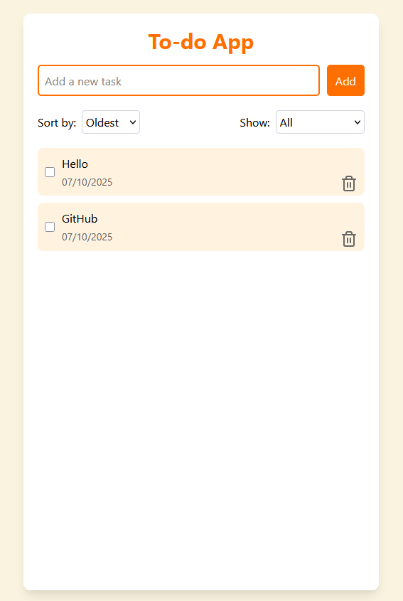

# 📝 Todo App – Simple Task Management

## Overview
A straightforward and efficient task management application for creating, organizing, and tracking todos. Built with React, TypeScript, and Redux for a smooth, responsive user experience.

## 🌐 Live Demo
**[View Live Site](https://alexdegerman.github.io/to-do-app-ts)** ⭐ Try it out without any setup!

## ✨ Key Features
- ➕ **Create todos** with a simple input interface
- ✅ **Mark tasks as complete** to track progress
- 🔍 **Search functionality** to quickly find specific tasks
- 🔀 **Sort todos** by various criteria (date, status, etc.)
- 🗑️ **Delete tasks** when no longer needed
- 📱 **Responsive UI** that works seamlessly on all devices

## 🔧 Tech Stack
**Frontend:** React • TypeScript • Vite • Tailwind CSS  
**State Management:** Redux  
**Testing:** Vitest  

## 🚀 Installation & Setup

1. Clone the repository
2. Install dependencies with `npm install`
3. Run the development server with `npm run dev`
4. Open your browser to `http://localhost:5173`

## 📖 How It Works
1. **Type a task** in the input field and press Enter or click Add
2. **Click the checkbox** to mark tasks as complete or incomplete
3. **Filter tasks** by completion status using the dropdown menu
4. **Sort tasks** by newest or oldest using the dropdown menu
5. **Click delete** to remove tasks you no longer need

## 🎯 Development Highlights
- **Redux state management** for predictable, centralized state
- **TypeScript** for type-safe component development
- **Vite** for lightning-fast development and builds
- **Tailwind CSS** for modern, responsive styling
- **Vitest** for comprehensive component testing
- **Clean architecture** with separated concerns